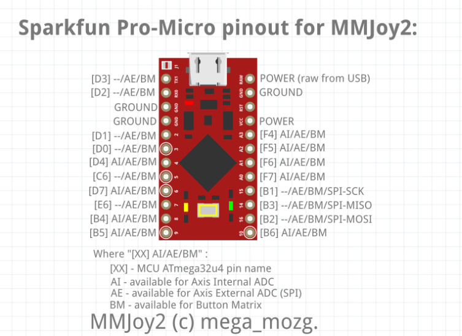
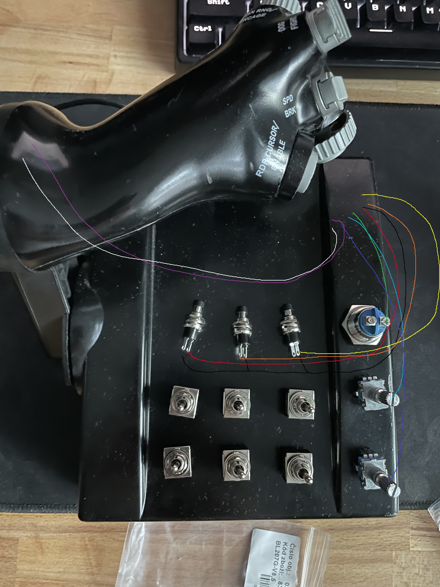
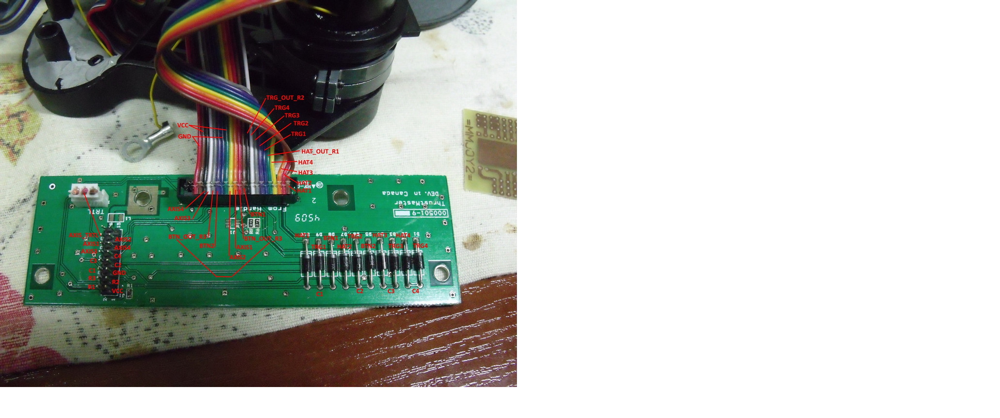
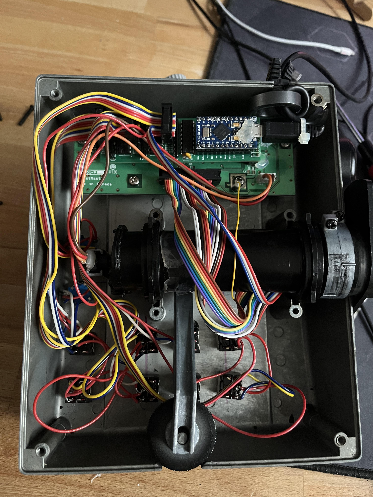
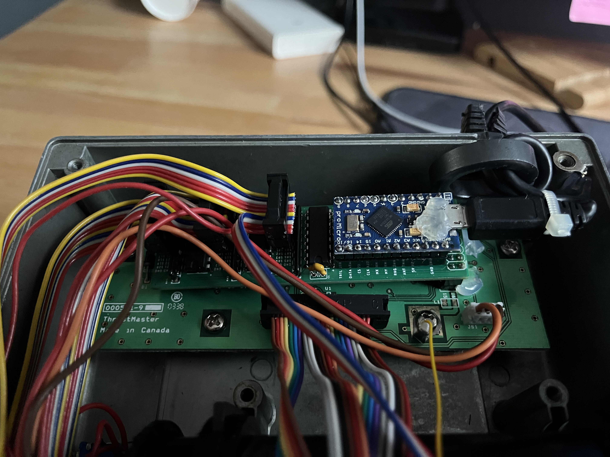
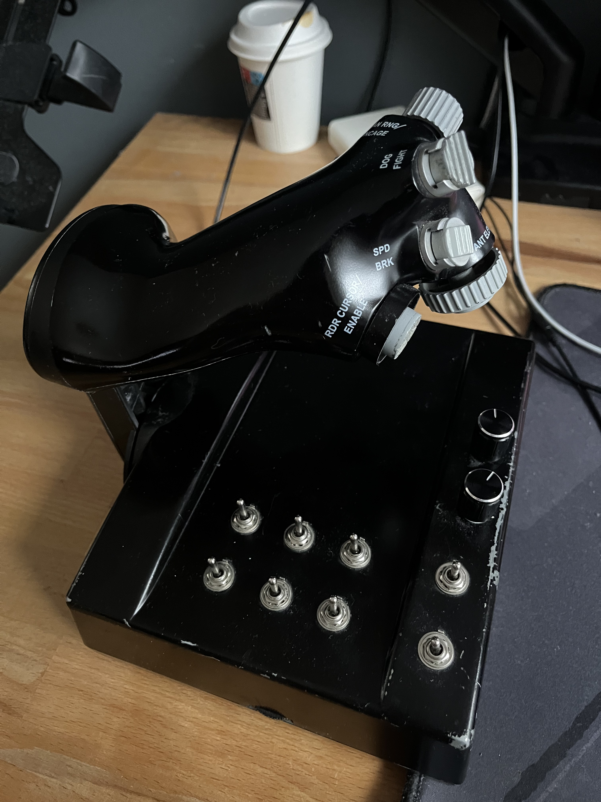
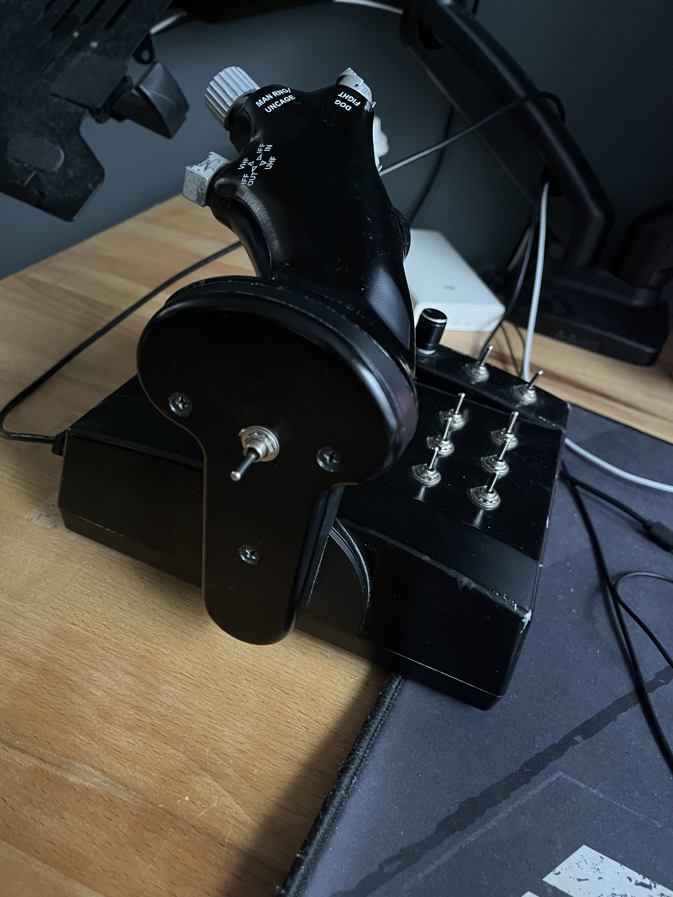

# Throttle Cougar Extended Upgrade

Hardware upgrade for ThrustMaster Cougar TQS throttle quadrant.

## Goal

Enable ThrustMaster Cougar throttle to work independently from Cougar stick, with additional switches and encoders. Uses native USB HID - no additional drivers required.

## MMJoy Firmware

This project uses [MMJoy](https://github.com/MMJoy/mmjoy_en) - open-source USB HID joystick firmware for Arduino.

- **Download**: https://github.com/MMJoy/mmjoy_en/releases
- **Wiki**: https://github.com/MMjoy/mmjoy_en/wiki

## MMJoy Configuration Files

Two pre-configured MMJoy settings are included in `mmjoy_setup/`:

### tm_cougar_mlu_32b+hat.mmjoy
- **32 buttons** + hat switch
- 6 axes (throttle, X, Y, rX, rY, Slider)
- CRS (course) controls mapped as **axes**

### tm_cougar_mlu_36b+hat_crs_asbut.mmjoy
- **36 buttons** + hat switch (32 + **4 additional** buttons)
- 6 axes (throttle, X, Y, rX, rY, Slider)
- CRS (course) controls mapped as **buttons** (for target cursor control in simulators)

Both configurations work identically. Choose 36-button version if you want to control target cursor with buttons instead of axes.

## Hardware

### Required Components

| Component | Description | Example |
|-----------|-------------|---------|
| ThrustMaster Cougar TQS | Original throttle quadrant | N/A |
| Custom PCB | Interface board | Order package in `order/` |
| Arduino Pro Micro | USB HID controller (ATmega 32u4) | Generic clone, 5V/16MHz, USB-C version is recommended |
| 1x 2x8-pin connector | For throttle button matrix | 2x8-pin connector |

### Optional Components

| Component | Description | Example |
|-----------|-------------|---------|
| 3x 74HC165 | 8-bit shift register | SN74HC165N DIP-16 |
| 9x Toggle Switch | (ON)-OFF-(ON) DPDT | RS PRO 206-6978 |
| 2x Rotary Encoder | KY-040 with push button | KY-040 module |
| 1x 24-pin DIP socket | For Arduino Pro Micro | |
| 3x 16-pin DIP socket | For 74HC165 | 16-pin DIP socket |
| 3x 10-pin connector | For additional buttons (2x5 IDC header) | 10-pin connector |
| Ribbon cable | 10-pin flat cable | or other cables |

### Recomendation

Orignal throttle and other axis potenciometers can stay and work very wel. But I strongly recommend upgrade to Hall sensors. Unfortunatelly this is still  WIP from my side.

## Wiring and Pinout

### Assembly Images

*Internal view showing PCB, Arduino Pro Micro, shift registers, and wiring*

*Close-up of Arduino Pro Micro installed in socket with connected wires*

*Front view of completed throttle with toggle switches*

*Side view showing throttle grip and switch placement*

The custom PCB can be ordered from any PCB manufacturer (JLCPCB, PCBWay, Seeed, etc.) using Gerber files in `order/` folder.

**No electrical modifications to Cougar throttle are required** - simply connect the custom PCB onto Cougar PCB 2x8 DIP connector and connect via USB.

## Getting Started

1. **Order PCB** - Download Gerber files from `order/` folder
2. **Assemble** - Solder components, install Arduino and shift registers in sockets, connect to throttle
3. **Flash firmware** - Upload MMJoy to Arduino Pro Micro ([see MMJoy Wiki](https://github.com/MMjoy/mmjoy_en/wiki/Firmware-upload))
4. **Configure** - Use MMJoy configurator to set up inputs/outputs. Load configuration from `mmjoy_setup/` and modify based on your wiring
5. **Test** - Verify all buttons, encoders, and axes work correctly

## Project Structure

| Folder | Description |
|--------|-------------|
| `board/` | PCB design files (Eagle) |
| `mmjoy_setup/` | MMJoy configuration files |
| `order/` | Gerber files for PCB manufacturing |
| `references/` | Reference documentation |

## License

CC BY-NC-SA 4.0 - Non-commercial use only, share-alike
